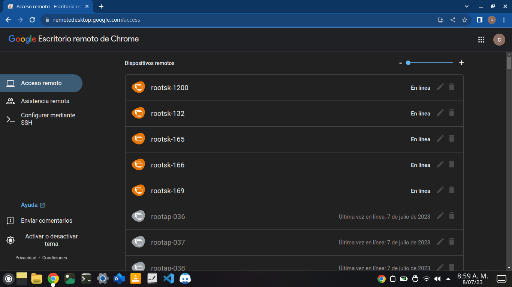

# PC REMOTO
# USO

Bien esta documentacion es mas sencilla ya que el script es un poco mas facil y es un poco mas corto

Vamos a empezar por el inicio de sesion en google el cual el correo es 

```bash
latinoamericacampus233@gmail.com
```

y su contraseña

```bash
Lmpc1327
```

una vez hayamos entrado a la cuenta nos vamos a dirigir a la siguiente [url](https://remotedesktop.google.com/headless)

```bash
https://remotedesktop.google.com/headless
```

Nos debera de aparecer una pantalla de la siguiente forma



Y ya en este momento podremos ver todos los computadores que estan prendidos en ese monento

Podemos entrar a ese computador para apagarlo o para actualizarlo y para hacer cualquier accion requerida 

Nos pedira un pin que en este caso es el pin de **ssh**, el cual es

```bash
04262425933
```

Y luego nos pedira la contraseña root de cada computador

En este caso aca esta la lista de los usuarios con sus contraseñas

| ROOT | PASSWORD |
|---|---|
|rootsp|C@mp2@@3Spuk$|
|rootsk|C@mp2@@3Skyl$|
|rootap|C@mp2@@3Apol$|
|rootar|C@mp2@@3Arte$|
---

# INSTALACION

En este caso estaremos hablando de un pc que tenga sistema operativo ubuntu 

Para ello lo primero que haremos sera 

### PASO 1

VAMOS A ENTRAR A LA SIGUIENTE URL

```bash
https://dl.google.com/linux/direct/chrome-remote-desktop_current_amd64.deb
```

Luego solo abriremos la carpeta de descarga y estando en ella 

vamos a abirir la **terminal** y colocaremos el siguiente codigo

### PASO 2

```bash
#!/bin/sh

# Define la contraseña
export PASSWORD='cambiar-por-contraseña-real'

sudo -S apt update <<< "$PASSWORD"

sudo -S apt upgrade -y

sudo -S apt --fix-broken install <<< "$PASSWORD"

# Instala los paquetes
sudo -S apt-get install xvfb xserver-xorg-video-dummy xbase-clients python3-psutil libutempter0 <<< "$PASSWORD"

# Ejecuta el dpkg
sudo -S dpkg -i chrome-remote-desktop_current_amd64.deb <<< "$PASSWORD"

sudo su -
```

una vez hayamos entrado en modo sudo su -

colocaremos el siguiente codigo

### PASO 3

```bash
cd /etc/polkit-1/localauthority/50-local.d/

touch 47-user-admin.pkla

nano 47-user-admin.pkla
```

y luego de eso lo que haremos sera simplemente colocar 

```bash
[user admin]
Identity=unix-user:*
Action=org.gnome.controlcenter.user-accounts.administration
ResultAny=auth_admin_keep
ResultInactive=no
ResultActive=no
```

Y colocando eso en el archivo lo que haremos sera tocar la tecla 

```bash
ctrl + s
```
```bash
ctrl + x
```

### PASO 4

entraremos a la siguiente url

```bash
https://remotedesktop.google.com/headless
```

y estando alli solo le daremos sieguiente y siguiente hasta obtener el codigo ssh el cual lo copiaremos y vamos a pegar en la terminal 

en cuando lo peguemos nos pedira un codigo de seguridad para el ssh 

colocaremos el codigo dos veces ya que la segunda es de confirmacion

y por ultimo la contraseña root y cuando la terminemos de colocar ya daremos acceso completo de nuestro pc a la cuenta.